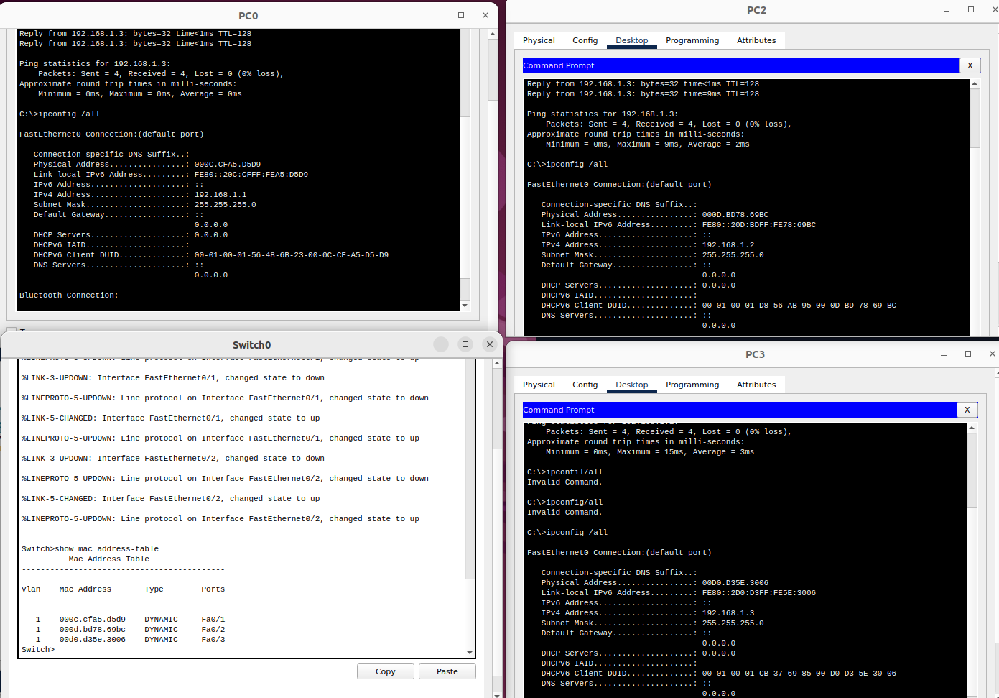

# **Workflow: Network Simulation and MAC Address Analysis**

---

## **1. Network Simulation**
- A small network was simulated using **Cisco Packet Tracer**.
- The network consists of:
  - **1 Switch**
  - **3 PCs (devices)**

---

## **2. Static IP Configuration**
- IP addresses were manually and statically configured for each PC.

---

## **3. Verifying IP and MAC Addresses**
- IP addresses were verified using the command:
  ```plaintext
  ipconfig /all
  ```
- The MAC addresses of the PCs were also checked, as the simulated PCs use a simple OS.

---

## **4. Initial ARP Table**
- Before generating traffic, the ARP table was checked using the `arp` command:
  ```plaintext
  arp
  ```
- **Observation:** No entries were initially found in the ARP table.

---

## **5. ARP Table Population**
- Traffic was generated using a series of **ping** commands between devices.
- After the pings, the ARP table was populated with entries. These entries include:
  - **MAC addresses** corresponding to the devices.
  - **A cache timeout value** (e.g., `100s`, `110s`).

---

## **6. Viewing the Switch MAC Address Table**
- The MAC address table of the switch was viewed using the following command on the switch CLI:
  ```plaintext
  show mac address-table
  ```


---

## **7. Packet Capture and Analysis**
- To analyze **Ethernet frames** and **MAC addressing**:
  - **Wireshark with GNS3:** Wireshark can be integrated with **GNS3** to capture and analyze traffic.
  - **Packet Tracer:** The built-in **Packet Capture Tool** was used to observe:
    - **Ethernet frames**
    - **Source and destination MAC addresses** in the network.

---