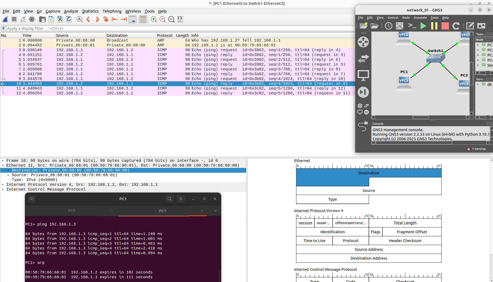

# **Simulating a Network and Analyzing Traffic Using GNS3 and Wireshark**

---

## **1. Network Simulation**
- A network is created and simulated using **GNS3** to represent real-world networking scenarios.

---

## **2. Traffic Generation**
- Network traffic is generated by **pinging** devices, which sends ICMP echo requests and responses.

---

## **3. ARP Broadcast Messages**
- When a device initiates communication:
  - An **initial ARP broadcast** occurs to resolve the destination's MAC address for the given IP.
  - This ARP message contains:
    - **Source Address** (MAC and IP)
    - **Destination Address**
    - **Payload**
    - **Frame Check Sequence (FCS)** for error checking.

---

## **4. ICMP Messages**
- After the ARP resolution:
  - **ICMP messages** (Echo Request and Echo Reply) are used to verify connectivity.
  - These packets are sent directly from source to destination (no broadcast), as the ARP table now contains the resolved MAC address.

---

## **5. Traffic Analysis with Wireshark**
- The traffic is captured and analyzed using **Wireshark**:
  - The ARP and ICMP messages are inspected.
  - Details like source MAC, destination MAC, IP addresses, and payloads are studied for a deeper understanding of the network's behavior.

---

## **Key Insights**
- The ARP protocol dynamically resolves MAC addresses for IP communication.
- Once resolved, ICMP facilitates direct communication between devices without broadcasting.
- **Wireshark** serves as a powerful tool to analyze and visualize traffic flows, ARP requests, ICMP messages, and other protocol operations.

---
