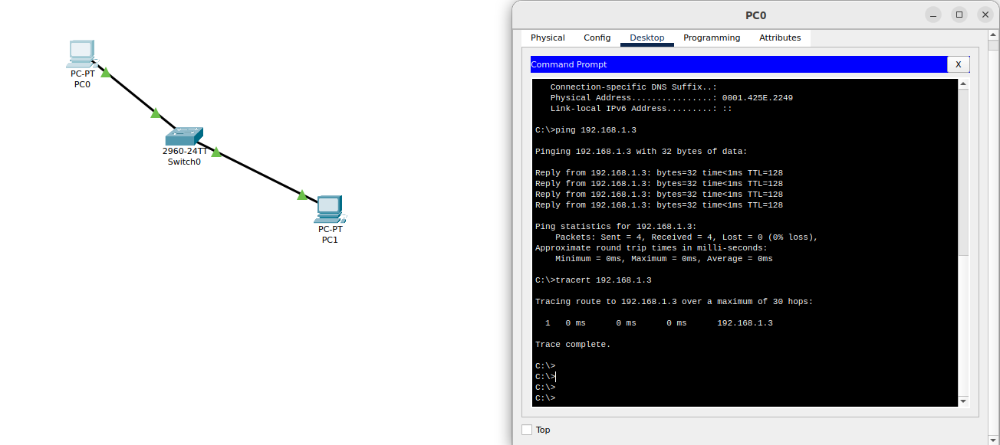

# **Troubleshoot Ethernet Communication with Ping and Traceroute using Packet Tracer**

## **1. Overview**
To demonstrate troubleshooting Ethernet communication between two PCs using **ping** and **traceroute** `tracert` in **Cisco Packet Tracer**.

---

## **2. Network Setup**
A simple network is created using **Cisco Packet Tracer**, consisting of:
- **Two PCs** (`PC0` and `PC1`)
- **A Switch** (`2960`)
- **Ethernet connections** between devices

Each PC is assigned an IP address in the same network.

---

## **3. Checking Ethernet Communication**

### **3.1 Using Ping Command**
```bash
ping 192.168.1.3
```
### **3.2 Using Traceroute (tracert)**
```bash
tracert 192.168.1.3
```

If the connection is broken, it will show Request timed out at a specific hop.


---

## **4. Observations**
- Ping confirms basic connectivity between PCs.
- Traceroute helps identify any broken links or excessive hops.

---