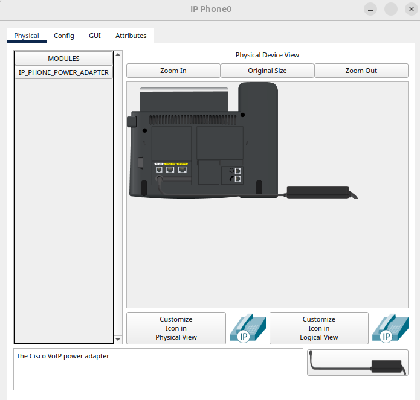

# **Network Configuration for VLAN and VoIP Setup**

---

## **1. Network Configuration**

### **IP Addressing**

| Device        | IP Address      | Subnet Mask     | Gateway        | Role                  |
|--------------|----------------|----------------|----------------|------------------------|
| PC          | 192.168.10.2    | 255.255.255.0  | 192.168.10.1   | Data Device (VLAN 10)  |
| VoIP Phone  | 192.168.20.2    | 255.255.255.0  | 192.168.20.1   | Voice Device (VLAN 20) |
| Switch VLAN 1 | 192.168.1.1   | 255.255.255.0  | -              | Switch Management      |


### **Turning on IP Phone**



---

## **2. Step-by-Step Configuration**

### **Step 1: Configure VLANs on the Switch**

#### **Create VLAN 10 (Data VLAN):**
```plaintext
Switch> enable
Switch# configure terminal
Switch(config)# vlan 10
Switch(config-vlan)# name Data_VLAN
Switch(config-vlan)# exit
```

#### **Create VLAN 20 (Voice VLAN):**
```plaintext
Switch(config)# vlan 20
Switch(config-vlan)# name Voice_VLAN
Switch(config-vlan)# exit
```

---

### **Step 2: Configure the Switch Port**

#### **Assign Access VLAN (Data) and Enable Voice VLAN:**

Configure the port connecting to the PC and VoIP phone combo (e.g., Fa0/1):
```plaintext
Switch(config)# interface Fa0/1
Switch(config-if)# switchport mode access
Switch(config-if)# switchport access vlan 10
Switch(config-if)# switchport voice vlan 20
Switch(config-if)# exit
```

#### **Enable Quality of Service (Optional):**

Prioritize voice traffic on the configured port:
```plaintext
Switch(config)# interface Fa0/1
Switch(config-if)# mls qos trust cos
Switch(config-if)# exit
```


---

### **Step 3: Test VLAN Configuration**

#### **Verify VLAN Assignment:**
```plaintext
Switch# show vlan brief
```
Ensure that VLAN 10 and VLAN 20 are listed and ports are correctly assigned.

#### **Verify Port Configuration:**
```plaintext
Switch# show running-config interface Fa0/1
```
Confirm that both `access vlan 10` and `voice vlan 20` are configured.

---

### **Step 4: Configure the Devices**

#### **PC Configuration (Data VLAN):**
Set the PC’s IP address:
```plaintext
IP Address: 192.168.10.2
Subnet Mask: 255.255.255.0
Default Gateway: 192.168.10.1
```

#### **VoIP Phone Configuration (Voice VLAN):**
VoIP phones in Packet Tracer will automatically tag their voice traffic with the Voice VLAN (VLAN 20).

Set the phone’s IP address manually:
```plaintext
IP Address: 192.168.20.2
Subnet Mask: 255.255.255.0
Default Gateway: 192.168.20.1
```

---

### **Step 5: Verify Connectivity**

#### **From the PC:**
- Ping the gateway (192.168.10.1) to verify connectivity for VLAN 10.
- Confirm that the PC cannot communicate directly with VLAN 20 devices (segregated by VLANs).

#### **From the VoIP Phone:**
- Ping the gateway (192.168.20.1) to verify connectivity for VLAN 20.
- Confirm that voice traffic is properly handled by the switch.

#### **Capture and Observe Traffic:**
- Use the **Simulation Mode** in Packet Tracer to ensure:
  - Traffic from PCs uses VLAN 10.
  - Traffic from VoIP phones uses VLAN 20.

---

## **3. Key Points**

### **Voice VLAN:**
- Voice traffic is tagged with VLAN 20 by the VoIP phone.
- The switch port configuration ensures that voice and data traffic are kept separate.

### **Data VLAN:**
- Data traffic is untagged and associated with VLAN 10 on the switch port.

### **Quality of Service (QoS):**
- Enabling QoS ensures that voice traffic gets higher priority over data traffic, which is critical for minimizing latency and jitter.

---

I tried to set up IP address of IP Phone but unable to set it using setting in GUI of IP Phone.

---